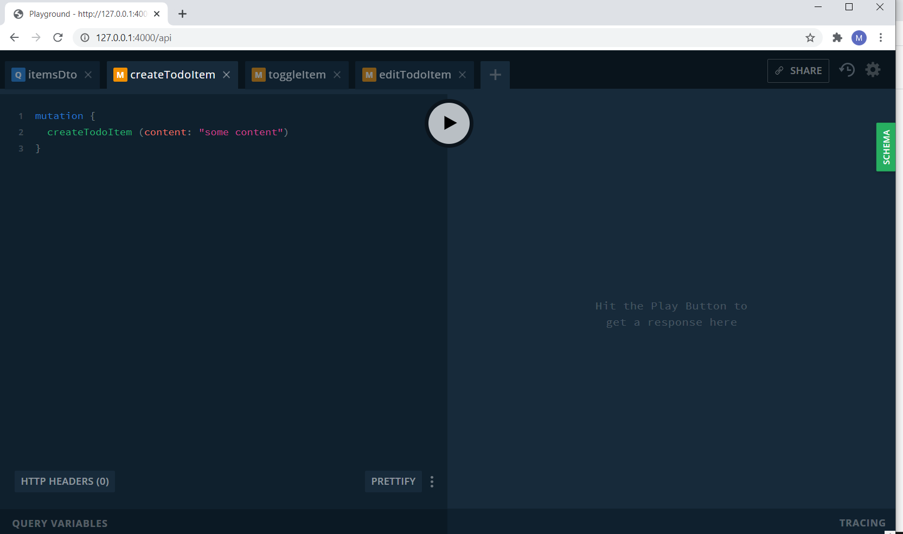
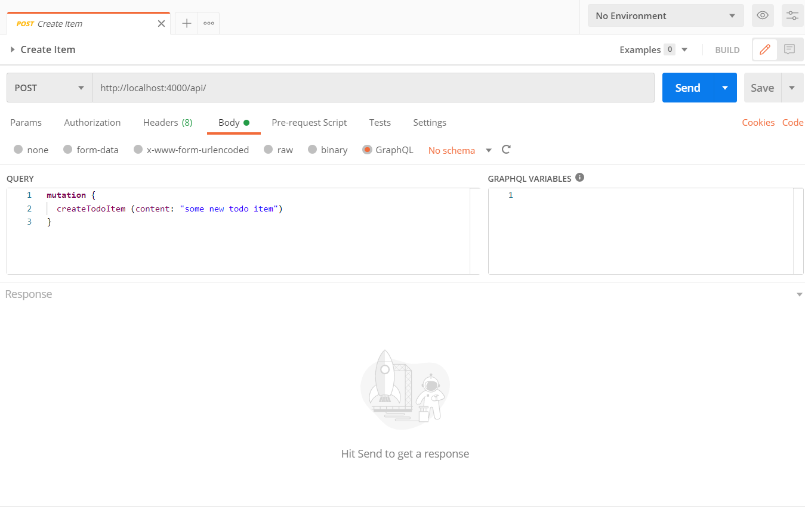

# TodoApp

This is a showcase for an Elixir app / Phoenix framework, it consumes GraphQl Api working with Postgres database. This example runs on docker in order to be platform agnostic. The app is a minimal example for a task fulfillment (Todo) software. It comprises the following:
- Creating new todo item
- Editing the todo item
- Toggling the item, being done (true) or not done yet (false)
- Querying the items

## Run
- Navigate to the project root directory
```
$ docker-compose up -d
```
- Open the endpoint `http://127.0.0.1:4000/api` to assure that the example is running properly.


## Test
- After assuring that the example is up and running, let's test it
- In postman import the file `Elixir Showcase.postman_collection.json` present in the project's root directory.
- It contains the tests needed as shown:
 

 ## Note
- Secrets are being embedded in the example's code, hence this code is not supposed to be a starting boilerplate for projects.
- Postgres is not persistent since there is no volumes defined in `docker-compose.yml`.